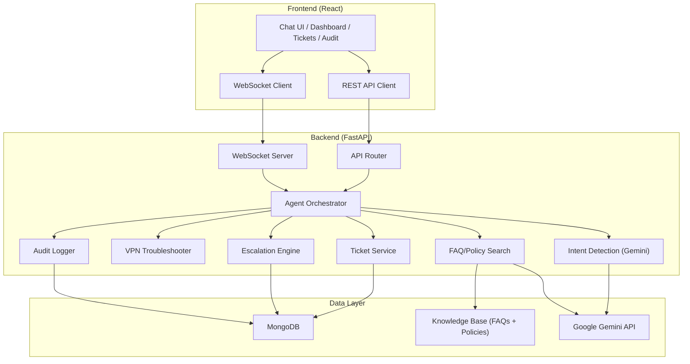

# Internal Service Agent — Implementation Plan

An AI-powered IT helpdesk chatbot that handles employee support queries, creates/tracks tickets, troubleshoots VPN issues, answers FAQs, and auto-escalates to human agents when needed.

## Tech Stack

| Layer | Technology |
|-------|-----------|
| **Frontend** | React 18 (CRA) + React Router v6 |
| **Styling** | Vanilla CSS with CSS variables (dark theme, glassmorphism) |
| **Backend** | FastAPI (Python 3.11+) |
| **Database** | MongoDB via Motor (async driver) |
| **AI/LLM** | Google Gemini API (`google-generativeai`) |
| **Realtime** | WebSocket (FastAPI native) |

---

## User Review Required

> [!IMPORTANT]
> **Gemini API Key**: You will need a valid Google Gemini API key set in `backend/.env` as `GEMINI_API_KEY`. The app will gracefully fall back to rule-based responses if no key is provided.

> [!IMPORTANT]
> **MongoDB**: A running MongoDB instance is required (default: `mongodb://localhost:27017`). The app will seed sample data on first run.

---

## Core Features

1. **AI Chat Interface** — Employees chat with the agent to resolve IT issues
2. **Intent Detection** — Gemini classifies queries into: `vpn_issue`, `faq`, `ticket_request`, `escalation`, `general`
3. **VPN Troubleshooting** — Guided step-by-step VPN diagnosis flow
4. **FAQ Answering** — Searches a knowledge base of IT FAQs and returns answers with source references
5. **Ticket Management** — Create, view, update, and track support tickets (CRUD)
6. **Auto-Escalation** — Escalates to human agent when: confidence < 0.4, user requests it, or issue is unresolved after 3 attempts
7. **Audit Trail** — Logs every agent action for compliance/review
8. **Dashboard** — Overview of ticket stats, recent conversations, and escalation alerts

---

## Proposed Changes

### Backend — Core Infrastructure

#### [NEW] [`requirements.txt`](file:///c:/Users/DELL/Desktop/internal%20service%20agent/backend/requirements.txt)
Dependencies: `fastapi`, `uvicorn`, `motor`, `pymongo`, `google-generativeai`, `python-dotenv`, `pydantic`, `python-jose`, `websockets`

#### [NEW] [`.env`](file:///c:/Users/DELL/Desktop/internal%20service%20agent/backend/.env)
Environment config: `GEMINI_API_KEY`, `MONGODB_URL`, `DATABASE_NAME`, `JWT_SECRET`, `CORS_ORIGINS`

#### [NEW] [`config.py`](file:///c:/Users/DELL/Desktop/internal%20service%20agent/backend/app/core/config.py)
Pydantic `Settings` class loading from `.env`. Centralizes all configuration.

#### [NEW] [`security.py`](file:///c:/Users/DELL/Desktop/internal%20service%20agent/backend/app/core/security.py)
Simple JWT-based auth with employee ID extraction. Lightweight — no full auth system, just employee identity.

#### [NEW] [`logging.py`](file:///c:/Users/DELL/Desktop/internal%20service%20agent/backend/app/core/logging.py)
Structured JSON logging with correlation IDs for request tracing.

---

### Backend — Database Layer

#### [NEW] [`database.py`](file:///c:/Users/DELL/Desktop/internal%20service%20agent/backend/app/database/database.py)
Motor async client setup. Collections: `employees`, `tickets`, `conversations`, `audit_logs`. Connection pooling and health check endpoint.

#### [NEW] [`seed.py`](file:///c:/Users/DELL/Desktop/internal%20service%20agent/backend/app/database/seed.py)
Seeds MongoDB with:
- 5 sample employees (with departments, roles)
- 10 sample tickets (various statuses)
- IT FAQ data
- Runs automatically on first startup if collections are empty

---

### Backend — Data Models

#### [NEW] [`employee.py`](file:///c:/Users/DELL/Desktop/internal%20service%20agent/backend/app/models/employee.py)
Fields: `employee_id`, `name`, `email`, `department`, `role`, `created_at`

#### [NEW] [`ticket.py`](file:///c:/Users/DELL/Desktop/internal%20service%20agent/backend/app/models/ticket.py)
Fields: `ticket_id`, `employee_id`, `subject`, `description`, `category`, `priority` (low/medium/high/critical), `status` (open/in_progress/resolved/escalated/closed), `assigned_to`, `created_at`, `updated_at`, `resolution_notes`, `escalation_reason`

#### [NEW] [`conversation.py`](file:///c:/Users/DELL/Desktop/internal%20service%20agent/backend/app/models/conversation.py)
Fields: `conversation_id`, `employee_id`, `messages[]` (role, content, timestamp, metadata), `intent`, `status`, `created_at`

#### [NEW] [`audit.py`](file:///c:/Users/DELL/Desktop/internal%20service%20agent/backend/app/models/audit.py)
Fields: `audit_id`, `action_type`, `actor` (agent/employee/system), `target_entity`, `details`, `timestamp`

---

### Backend — Schemas (Pydantic)

#### [NEW] [`chat_schema.py`](file:///c:/Users/DELL/Desktop/internal%20service%20agent/backend/app/schemas/chat_schema.py)
Request/response schemas for chat messages, conversation history.

#### [NEW] [`ticket_schema.py`](file:///c:/Users/DELL/Desktop/internal%20service%20agent/backend/app/schemas/ticket_schema.py)
CRUD schemas for tickets with validation.

#### [NEW] [`response_schema.py`](file:///c:/Users/DELL/Desktop/internal%20service%20agent/backend/app/schemas/response_schema.py)
Unified API response wrapper with `success`, `data`, `error`, `metadata`.

---

### Backend — AI Services (Core Logic)

#### [NEW] [`agent.py`](file:///c:/Users/DELL/Desktop/internal%20service%20agent/backend/app/services/agent.py)
**Main orchestrator**. Routes incoming messages through:
1. Intent detection → 2. Service dispatch → 3. Response generation → 4. Escalation check → 5. Audit logging

#### [NEW] [`intent_detection.py`](file:///c:/Users/DELL/Desktop/internal%20service%20agent/backend/app/services/intent_detection.py)
Uses Gemini to classify user intent. Returns `{intent, confidence, entities}`. Falls back to keyword matching if API unavailable.

Supported intents:
- `vpn_issue` — VPN connectivity, configuration
- `faq` — General IT questions
- `ticket_request` — Create/check ticket status
- `escalation` — User explicitly requests human help
- `general` — Greeting, thanks, unclear

#### [NEW] [`policy_search.py`](file:///c:/Users/DELL/Desktop/internal%20service%20agent/backend/app/services/policy_search.py)
Searches the FAQ knowledge base (`it_faq.json`) using keyword matching + Gemini for answer synthesis. Returns answers with source references.

#### [NEW] [`troubleshooting.py`](file:///c:/Users/DELL/Desktop/internal%20service%20agent/backend/app/services/troubleshooting.py)
VPN troubleshooting decision tree:
1. Check VPN client installed → 2. Verify credentials → 3. Test network connectivity → 4. Check firewall rules → 5. Escalate if unresolved

#### [NEW] [`ticket_service.py`](file:///c:/Users/DELL/Desktop/internal%20service%20agent/backend/app/services/ticket_service.py)
CRUD operations for tickets. Auto-assigns priority based on keywords. Generates ticket IDs.

#### [NEW] [`escalation.py`](file:///c:/Users/DELL/Desktop/internal%20service%20agent/backend/app/services/escalation.py)
Escalation rules engine:
- Confidence < 0.4 → auto-escalate
- User says "talk to human" / "escalate" → immediate escalation
- 3+ failed resolution attempts → auto-escalate
- Critical priority tickets → auto-escalate

Creates escalation audit entry and notifies (via alert in UI).

#### [NEW] [`audit_service.py`](file:///c:/Users/DELL/Desktop/internal%20service%20agent/backend/app/services/audit_service.py)
Logs all agent actions to MongoDB `audit_logs` collection. Provides query/filter capabilities for the audit trail page.

---

### Backend — Knowledge Base

#### [NEW] [`it_faq.json`](file:///c:/Users/DELL/Desktop/internal%20service%20agent/backend/app/knowledge_base/faqs/it_faq.json)
30+ FAQ entries covering: password resets, VPN setup, software requests, email config, printer setup, security policies.

#### [NEW] Policy PDFs (placeholder `.txt` files)
`password_policy.pdf`, `vpn_policy.pdf`, `laptop_policy.pdf`, `software_installation_policy.pdf` — stored as text files with realistic policy content for demo purposes.

---

### Backend — API Routes

#### [NEW] [`main.py`](file:///c:/Users/DELL/Desktop/internal%20service%20agent/backend/app/main.py)
FastAPI app initialization, CORS config, WebSocket endpoint, router mounting, startup/shutdown events (DB connect, seeding).

#### [NEW] [`routes.py`](file:///c:/Users/DELL/Desktop/internal%20service%20agent/backend/app/api/routes.py)
Master router aggregating all sub-routers.

#### [NEW] [`chat_routes.py`](file:///c:/Users/DELL/Desktop/internal%20service%20agent/backend/app/api/chat_routes.py)
- `POST /api/chat/message` — Send message, get AI response
- `GET /api/chat/conversations/{employee_id}` — Get conversation history
- `WebSocket /ws/chat/{employee_id}` — Real-time chat

#### [NEW] [`ticket_routes.py`](file:///c:/Users/DELL/Desktop/internal%20service%20agent/backend/app/api/ticket_routes.py)
- `POST /api/tickets` — Create ticket
- `GET /api/tickets` — List all tickets (with filters)
- `GET /api/tickets/{ticket_id}` — Get ticket details
- `PUT /api/tickets/{ticket_id}` — Update ticket
- `GET /api/tickets/stats` — Dashboard statistics

#### [NEW] [`audit_routes.py`](file:///c:/Users/DELL/Desktop/internal%20service%20agent/backend/app/api/audit_routes.py)
- `GET /api/audit` — List audit logs (with pagination, filters)
- `GET /api/audit/{audit_id}` — Get audit entry detail

---

### Backend — Utilities & Tests

#### [NEW] [`date_utils.py`](file:///c:/Users/DELL/Desktop/internal%20service%20agent/backend/app/utils/date_utils.py)
Timezone-aware datetime helpers, relative time formatting.

#### [NEW] [`validators.py`](file:///c:/Users/DELL/Desktop/internal%20service%20agent/backend/app/utils/validators.py)
Input sanitization, email validation, ticket ID format validation.

#### [NEW] Test files (`test_chat.py`, `test_ticket.py`, `test_escalation.py`, `test_policy_search.py`)
Pytest-based unit tests with mocked Gemini responses and MongoDB.

---

### Frontend — Setup & Entry

#### [NEW] [`package.json`](file:///c:/Users/DELL/Desktop/internal%20service%20agent/frontend/package.json)
Dependencies: `react`, `react-dom`, `react-router-dom`, `react-scripts`, `react-icons`, `react-hot-toast`

#### [NEW] [`index.html`](file:///c:/Users/DELL/Desktop/internal%20service%20agent/frontend/index.html)
HTML shell with Google Fonts (Inter), meta tags, favicon.

#### [NEW] [`main.jsx`](file:///c:/Users/DELL/Desktop/internal%20service%20agent/frontend/src/main.jsx)
React root render with BrowserRouter.

#### [NEW] [`App.jsx`](file:///c:/Users/DELL/Desktop/internal%20service%20agent/frontend/src/App.jsx)
Route definitions: `/` (Dashboard), `/chat` (SupportChat), `/tickets` (Tickets), `/audit` (AuditTrail). Includes persistent Sidebar.

---

### Frontend — Pages

#### [NEW] [`Dashboard.jsx`](file:///c:/Users/DELL/Desktop/internal%20service%20agent/frontend/src/pages/Dashboard.jsx)
- Stat cards: Open tickets, Resolved today, Avg response time, Active escalations
- Recent tickets table
- Escalation alerts banner
- Quick-action buttons

#### [NEW] [`SupportChat.jsx`](file:///c:/Users/DELL/Desktop/internal%20service%20agent/frontend/src/pages/SupportChat.jsx)
Full chat interface with conversation history sidebar, message list, and input. Uses `useChat` hook for WebSocket communication.

#### [NEW] [`Tickets.jsx`](file:///c:/Users/DELL/Desktop/internal%20service%20agent/frontend/src/pages/Tickets.jsx)
Ticket list with filter/search, ticket detail modal, create ticket form. Status badges with color coding.

#### [NEW] [`AuditTrail.jsx`](file:///c:/Users/DELL/Desktop/internal%20service%20agent/frontend/src/pages/AuditTrail.jsx)
Chronological audit log with filters (action type, date range, actor). Expandable rows showing full details.

---

### Frontend — Components

#### [NEW] [`ChatWindow.jsx`](file:///c:/Users/DELL/Desktop/internal%20service%20agent/frontend/src/components/ChatWindow.jsx)
Message list container with auto-scroll, typing indicator, and source references for FAQ answers.

#### [NEW] [`Message.jsx`](file:///c:/Users/DELL/Desktop/internal%20service%20agent/frontend/src/components/Message.jsx)
Individual message bubble — different styles for user vs. agent. Renders markdown, shows timestamps.

#### [NEW] [`ChatInput.jsx`](file:///c:/Users/DELL/Desktop/internal%20service%20agent/frontend/src/components/ChatInput.jsx)
Text input with send button, Enter to send, shift+Enter for newline. Disabled during agent processing.

#### [NEW] [`TicketCard.jsx`](file:///c:/Users/DELL/Desktop/internal%20service%20agent/frontend/src/components/TicketCard.jsx)
Card component showing ticket summary, priority badge, status, and assignee.

#### [NEW] [`TicketStatus.jsx`](file:///c:/Users/DELL/Desktop/internal%20service%20agent/frontend/src/components/TicketStatus.jsx)
Status badge component with color mapping (open=blue, in_progress=amber, resolved=green, escalated=red, closed=gray).

#### [NEW] [`SourceReference.jsx`](file:///c:/Users/DELL/Desktop/internal%20service%20agent/frontend/src/components/SourceReference.jsx)
Displays source references for FAQ/policy answers (document name, relevance score).

#### [NEW] [`EscalationAlert.jsx`](file:///c:/Users/DELL/Desktop/internal%20service%20agent/frontend/src/components/EscalationAlert.jsx)
Animated alert banner for active escalations with urgency level and action buttons.

#### [NEW] [`Sidebar.jsx`](file:///c:/Users/DELL/Desktop/internal%20service%20agent/frontend/src/components/Sidebar.jsx)
Navigation sidebar with icons, active state highlighting, collapsible on mobile.

---

### Frontend — Services, Hooks & Utils

#### [NEW] [`api.js`](file:///c:/Users/DELL/Desktop/internal%20service%20agent/frontend/src/services/api.js)
Axios-like fetch wrapper for all API calls. Base URL config, error handling, auth header injection.

#### [NEW] [`useChat.js`](file:///c:/Users/DELL/Desktop/internal%20service%20agent/frontend/src/hooks/useChat.js)
Custom React hook managing WebSocket connection, message state, send/receive, reconnection logic.

#### [NEW] [`formatters.js`](file:///c:/Users/DELL/Desktop/internal%20service%20agent/frontend/src/utils/formatters.js)
Date formatting, relative timestamps ("2 hours ago"), ticket ID display formatting.

---

### Frontend — Styles

#### [NEW] [`App.css`](file:///c:/Users/DELL/Desktop/internal%20service%20agent/frontend/src/styles/App.css)
Global design system: CSS custom properties (dark theme colors, spacing scale, border radii, shadows), typography (Inter font), layout grid, glassmorphism utilities, animation keyframes.

**Color palette**: Deep navy background (#0a0e1a), electric blue accents (#3b82f6), glass panels (rgba white overlays), gradient borders.

#### [NEW] [`Chat.css`](file:///c:/Users/DELL/Desktop/internal%20service%20agent/frontend/src/styles/Chat.css)
Chat bubbles, typing indicator animation, message list scroll, source reference cards.

#### [NEW] [`Dashboard.css`](file:///c:/Users/DELL/Desktop/internal%20service%20agent/frontend/src/styles/Dashboard.css)
Stat cards with gradient backgrounds, table styling, alert animations.

#### [NEW] [`Ticket.css`](file:///c:/Users/DELL/Desktop/internal%20service%20agent/frontend/src/styles/Ticket.css)
Ticket cards, status badges, filter bar, modal overlay.

---

### Root Files

#### [NEW] [`README.md`](file:///c:/Users/DELL/Desktop/internal%20service%20agent/README.md)
Project overview, setup instructions, architecture diagram, API docs summary.

#### [NEW] [`.gitignore`](file:///c:/Users/DELL/Desktop/internal%20service%20agent/.gitignore)
Standard ignores for Node, Python, IDE files, `.env`.

---

## Architecture Diagram



---

## Build & Execution Order

| Phase | Steps |
|-------|-------|
| **1. Backend Core** | `.env`, `config.py`, `database.py`, models, schemas |
| **2. Knowledge Base** | FAQ JSON, policy text files |
| **3. Backend Services** | `intent_detection.py`, `policy_search.py`, `troubleshooting.py`, `ticket_service.py`, `escalation.py`, `audit_service.py`, `agent.py` |
| **4. API Routes** | `chat_routes.py`, `ticket_routes.py`, `audit_routes.py`, `main.py` |
| **5. Database Seeding** | `seed.py` with sample data |
| **6. Frontend Core** | `package.json`, `index.html`, CSS design system, `App.jsx` |
| **7. Frontend Components** | All 8 components |
| **8. Frontend Pages** | Dashboard, SupportChat, Tickets, AuditTrail |
| **9. Frontend Services** | `api.js`, `useChat.js`, `formatters.js` |
| **10. Tests & Docs** | Unit tests, README |

---

## Verification Plan

### Automated Tests
```bash
# Backend
cd backend && pip install -r requirements.txt
pytest tests/ -v

# Frontend
cd frontend && npm install
npm start
```

### Manual Verification
- Start backend: `cd backend && uvicorn app.main:app --reload`
- Start frontend: `cd frontend && npm start`
- Test chat flow: send VPN issue → verify troubleshooting steps
- Test FAQ: ask "how do I reset my password" → verify sourced answer
- Test ticket creation via chat
- Test escalation trigger
- Verify audit trail logging
- Verify dashboard stats update
